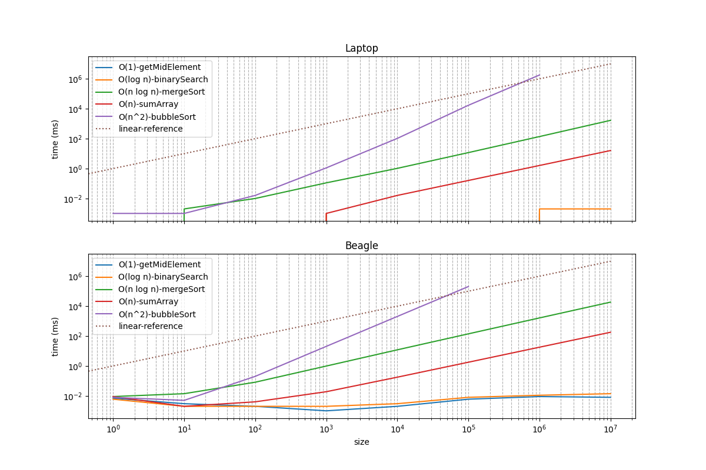

# Embedded Systems UEF - Spring 2026
This repository contains the code for the Embedded Systems course at UEF

## Exercise 1 - Introduction
- [Arduino Nano Every full pinout](https://docs.arduino.cc/resources/pinouts/ABX00028-full-pinout.pdf)
- Follow the [PWM DC Motor Guide](https://www.hackster.io/onedeadmatch/control-dc-motor-with-npn-transistor-arduino-pwm-cdaf2e), but use a lower resistance resistor 
for the fan (or it won't spin).

### Steps
Setup Arduino IDE for Nano Sense Every

1. Install the Arduino IDE:
    - [Arch Linux](https://wiki.archlinux.org/title/Arduino)
    - [Windows, macOS, and Ubuntu](https://support.arduino.cc/hc/en-us/articles/360019833020-Download-and-install-Arduino-IDE)
2. Plug the board into your computer with the provided USB Micro B cable
3. [Configure the IDE for Nano Every](https://learn.pakronics.com.au/arduino/tutorials/setup-arduino-every-board-in-arduino-ide)
### Troubleshooting

- [”avrdude: jtagmkII_initialize(): Cannot locate "flash" and "boot" memories in description"](https://support.arduino.cc/hc/en-us/articles/4405239282578-If-you-see-a-jtagmkII-initialize-Cannot-locate-flash-and-boot-memories-in-description-message-when-uploading-to-Nano-Every)
- [Arduino Debugging Basics](https://docs.arduino.cc/learn/microcontrollers/debugging/)


## Exercise 2 - Accelerometer & Screen
Configure the accelerometer & OLED Screen
### Steps


1. Install `Adafruit SSD1306 by Adafruit` in the Arduino IDE and optionally
`U8g2 by oliver` for a second OLED driver library option (it handles fonts better). Also install the `STM32duino LIS2DW12 by SRA` library for the accelerometer. You can also use `DFRobot_LIS by DFRobot` for the `DFRobot_LIS2DW12.h` header 
2. Wire the OLED and accelerometer to the SCL and SDA ports of the board. DO NOT use external pullup resistors with the OLED display. It won't work. Wire the 3.3V power output to the VCC line. DO NOT wire 5V to the accelerometer or it will kill the sensor.
### For Reference
- [Installing libraries in Arduino](https://docs.arduino.cc/software/ide-v1/tutorials/installing-libraries)
- [DFRobot Monochrome OLED Display](https://wiki.dfrobot.com/Monochrome_0.96_128x64_IIC_SPI_OLED_Display_SKU_DFR0650#FAQ)
- [DFRobot LIS2DW12 Triple Axis Accelerometer](https://wiki.dfrobot.com/LIS2DW12_Triple_Axis_Accelerometer_SKU_SEN0405#)
- [DIY Simple Three-axis Accelerometer Data Logger](https://community.dfrobot.com/makelog-313124.html)
- [I2C Protocol](https://www.compilenrun.com/docs/iot/arduino/arduino-communication/arduino-i2c-protocol)

## Exercise 3 - Gyroscope
Add the gyroscope sensor
### Steps

1. Install `Adafruit MPU6050 by Adafruit` and `MPU6050 by Electronic Cats` in the Arduino IDE.
2. Wire the OLED, accelerometer, and gyroscope to the SCL and SDA ports of the board. Follow the same precautions as before and ensure you use 3.3V power.

### Troubleshooting

### For Reference
- [DFRobot 6DOF MPU6050 Gyroscope](https://wiki.dfrobot.com/6_DOF_Sensor-MPU6050__SKU_SEN0142_)
- [DFRobot 6DOF MPU6050 Data Sheet](https://dfimg.dfrobot.com/enshop/image/data/SEN0142/PS-MPU-6000A.pdf)
- [Complimentary Filters](https://web.archive.org/web/20220518025559/http://www.pieter-jan.com/node/11)


## Exercise 4 - Magnetometer

1. Install `DFRobot_BMM150 by DFRobot` in the Arduino IDE.

### For Reference
- [DFRobot BMM150 Triple Axis Magnetometer ](https://wiki.dfrobot.com/SKU_SEN0419_Fermion_BMM150_Triple_Axis_Magnetometer_Sensor_Breakout)
- [Arduino Nano Every MCU Data Sheet](https://content.arduino.cc/assets/Nano-Every_processor-48-pin-Data-Sheet-megaAVR-0-series-DS40002016B.pdf)

## Oscilloscope Tutorial
See the `oscilloscope_tutorial` folder for code samples to run.
The tutorial is adapted from [Six Oscilloscope Measurements with Arduino](https://www.baldengineer.com/six-oscilloscope-measurements-using-arduino.html)
and more detailed information can be found there.

To complete the challenge follow these steps:
1. Check Auto-RESET on Arduino Nano Every. Locate the correct resistor via the datasheet and PCB diagram and probe it.
2. Check the TX/RX decode behavior. Run both the `2_uart_...` scripts. What is the difference between them?
3. Measured the 3.3V DC Voltage rail. Also measure the 5V voltage rail
4. See probe loading in action. Test a ceramic capacitor on the board and notice a difference!
5. PWM Duty Cycle testing with sound!
6. digitalWrite and port manipulation
7. Tone generation with register programming

This tutorial also uses concepts from the following:
- [Arduino Nano Every Register Deep Dive](https://wolles-elektronikkiste.de/en/arduino-nano-every-a-deep-dive)
- [Arduino Nano Every Timers and PWM](https://emalliab.wordpress.com/2022/01/23/arduino-nano-every-timers-and-pwm/)
- [Arduino Nano Every ATMega4808/4809 Data Sheet](https://ww1.microchip.com/downloads/aemDocuments/documents/MCU08/ProductDocuments/DataSheets/ATmega4808-09-DataSheet-DS40002173C.pdf)
- [Songs with the buzzer](https://github.com/hibit-dev/buzzer/tree/master/src/songs)

## Exercise 06 - Arduino Nicola Sense ME

1. In the Arduino IDE, install `Arduino Mbed OS Nicla Boards by Arduino` in the Boards Manager
2. Configure the board setup as `Arduino Nicla Sense ME`
3. Test the `led_blink` sketch and verify the on-board LED blinks
> NOTE:  If you get the following error (or something like it):
```bash
Error: unable to open CMSIS-DAP device 0x2341:0x60
Error: unable to find a matching CMSIS-DAP device nicla sense me
```
make sure you update your udev rules (as the library install says) by running 
```cpp
sudo "/home/alexbeat/.arduino15/packages/arduino/hardware/mbed_nicla/4.5.0/post_install.sh"
```
4. Verify that the LED is blinking white (red, green, blue combined).
5. Install `Arduino_BHY2 by Arduino` and `ArduinoBLE by Arduino` in the Library Manager
6. Run the `all_sensors_serial_read` example
7. Clone the zehpyr repository somewhere `git clone https://github.com/gateway240/zephyr-nicla-sense-me.git`
8. Setup the [zephyr repository](https://github.com/gateway240/zephyr-nicla-sense-me) according to the README

### References

- [Arduino IDE Firmware](https://docs.arduino.cc/tutorials/nicla-sense-me/cheat-sheet/#bsx-sensor-fusion-software)
- [Nicla Sense ME User Manual](https://docs.arduino.cc/tutorials/nicla-sense-me/user-manual/)

## Exercise 07 - MVP Start

## Exercise 08 - Embedded AI with BeagleBoardY-AI

Follow [the getting started guide](https://docs.beagle.cc/boards/beagley/ai/02-quick-start.html#connecting-to-wifi)
for the BeagleBoardY-AI.

Tasks:

1. Setup the boot media with bb-imager or Balena Etcher and insert the SD card into the board.
Please mount the heatsinks at least on CPU and RAM of the BeagleY-AI development board. Here is the [reference of their location](https://docs.beagle.cc/boards/beagley/ai/01-introduction.html#board-components-location).

2. Connect your board and ssh into it. Run `echo "hello world!"`. Setup key-based ssh authentication with the dev board.
3. Setup WiFi on the board using `iwctl`

## Exercise 09 - Algorithms & Object Detection

Comparison between Beagle and Laptop performance:


Tasks:

1. Clone the [demo repository](https://github.com/gateway240/beagley-ai-demos) onto the BeagleBoard and compile and run the `02-alg-bench`. Also run the benchmark on your normal computer and compare results 
(like the graph above).

2. Connect the camera and run the `03-object-detection` example Python app.
Transfer a collected image from the BeagleBoard to your computer and display it.

3. Run the `04-web-app` demo and connect to the web app in your browser on `localhost` on your computer.
 Show your working example!

References:
- [R5 core on BeagleY-AI](https://forum.beagleboard.org/t/making-use-of-r5-on-beagley-ai/38062/29)
- [BeagleY-AI R5 Zephyr fimrware](https://github.com/gateway240/beagley-ai-demos/tree/main)

## Exercise 10

